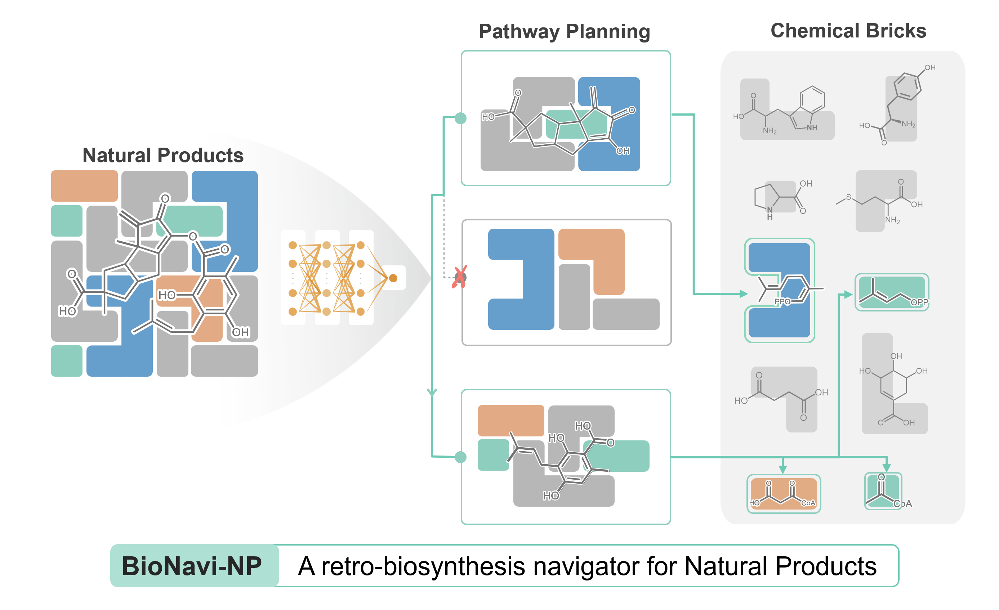

#### Introduction
Source code for the paper "Deep Learning Driven Biosynthesis Pathways Navigation for Natural Products with  BioNavi-NP". (Soon to be published in *Nature Communication*)



####  Setup
BioNavi-NP requires anaconda with python 3.7 or later, cudatoolkit=11.1. 

You will wish to install BioNavi-NP in a virtual environment to prevent conflicting dependencies.

```python
sudo apt-get install graphviz # for output visualization
conda create -n biosynthesis python==3.7
conda activate biosynthesis
cd multistep
sh install.sh
```
BioNavi-NP has been tested on Ubuntu 18.04, with four GPUs (Nvidia RTX3090). Installation should take no longer than 20 minutes on a modern server.

#### Planning
Demo code for multi-step planning has been placed in```run_biosynthesis.py```.

Run

```python
python run_biosynthesis.py
```

This demo now will take only 20 seconds with single GPU (Nvidia RTX3090). One need to first download the [checkpoints](https://drive.google.com/file/d/17DWd5K9vKUV3ynTbUA1yt_7YO0Xpts7c/view?usp=sharing) and unzip under ```biosynthesis/singlestep/checkpoints/``` to run the demo.  The output will be visulized in ```viz_dir```. 


The key functions are shown in the following block, You may run your own molecule by changing the 'target_mol' in  ```main_biosynthesis()```.

```python
def main_biosynthesis():
    input_dict = {
        'target_mol': 'N[C@@H](CNC(=O)C(=O)O)C(=O)O', # input molecule
        'expansion_topk': 50,
        'max_depth': 10,
        'expansion_iters': 10,
        'route_topk': 5,
        #'building_blocks': ['N[C@@H](CO)C(=O)O'] # one can assign a specific building block with this command
        'building_blocks':'retro_star/dataset/bio_data/bio_building_blocks_all/building_block.csv'
    }
    

    res = run(input_dict)
    print(res)
  
def run(input_dict):
    os.environ['CUDA_VISIBLE_DEVICES'] = '0, 1, 2, 3'

    # canonicalization
    mol = Chem.MolToSmiles(Chem.MolFromSmarts(input_dict['target_mol']))
    # the trained checkpoints path, one can simply reduce the checkpotins to accelerate the prediction. 
    one_step_model_path = [                                          
        '../singlestep/checkpoints/np-like/model_step_30000.pt',
        '../singlestep/checkpoints/np-like/model_step_50000.pt',
        '../singlestep/checkpoints/np-like/model_step_80000.pt',
        '../singlestep/checkpoints/np-like/model_step_100000.pt'
    ]                                                             
    value_fn_model_path = './retro_star/saved_models/best_epoch_final_4.pt'
    viz_dir = os.path.join('viz_' + str(int(time.time()))) # the output path with visualization
    ret_file_path = os.path.join('./viz/tmp/', viz_dir + '.zip')
    planner = RSPlanner(
        gpu=get_avai_gpu(),
        use_value_fn=True,
        value_fn_model_path=value_fn_model_path,
        fp_dim=2048,
        iterations=input_dict['expansion_iters'],
        expansion_topk=input_dict['expansion_topk'],
        route_topk=input_dict['route_topk'],
        one_step_model_type='onmt',
        buliding_block_path=input_dict['building_blocks'],
        mlp_templates_path=None,
        one_step_model_path=one_step_model_path,
        beam_size=20,
        viz=True,
        viz_dir=viz_dir 
    )

    result = planner.plan(mol)

    return result

```


#### Testing on the test set

Our work on BioNavi-NP features an evaluation on our test-set. We automated this evaluation by

```python
python run_batch_by_building_blocks.py
```
The whole process takes around 17 hours on four GPU (Nvidia RTX3090). One could modify the data_path and building_block_path in the script according to their own installation path. 